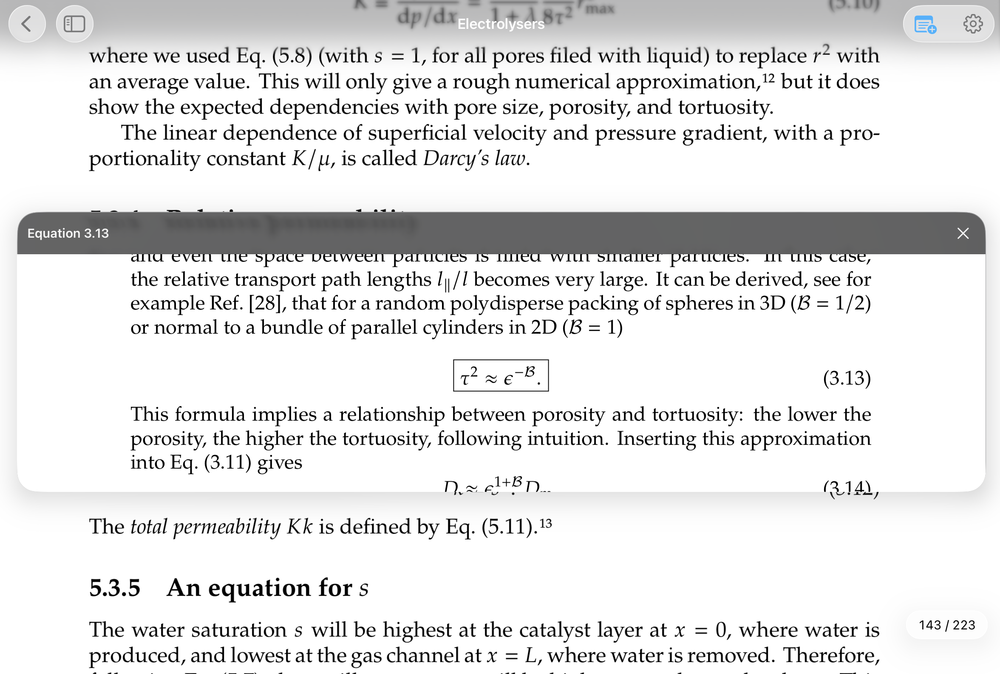

# STEMReader

STEMReader helps you turn textbook PDFs into an interactive study workspace on iPad. Browse chapters and exercises, preview references without losing your place, and work through problems with Apple Pencil.

## What you can do

- **Find your way through a textbook.** A BookMap organizes chapters, pages, exercises, figures, and references.
- **Keep reading while you explore.** Open equations, figures, and tables in floating previews.
- **Work through problems.** Keep the exercise in view while you write your solution.
- **Add notes to the page.** Attach handwritten notes to the part of a PDF they explain.
- **Organize your library.** Group your PDFs into collections and pick up where you left off.

Your original PDFs stay on your device. Reading is free, and your first cloud-scanned textbook is free for up to 1,000 pages. You can also choose free on-device scanning.

STEMReader is coming soon to the App Store. Visit [stemreader.app](https://stemreader.app) to explore the app, read the [privacy overview](https://stemreader.app/privacy/), or find [support](https://stemreader.app/support/). For help, email [stemreader@outlook.com](mailto:stemreader@outlook.com).

This repository contains the public STEMReader website. The images shown here are screenshots from the app.
